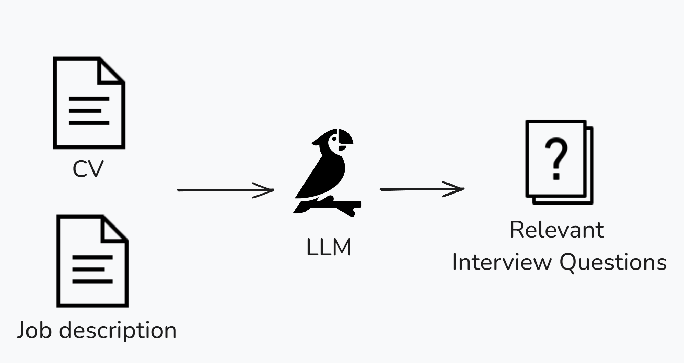
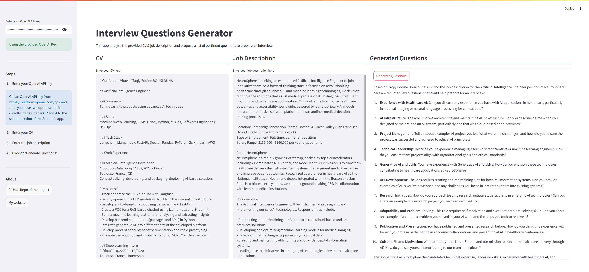

This application aims to generate relevant interview questions based on a CV and job description.
The demo is available at [this link](https://interviewquestionsgeneratorwithllm.streamlit.app/).

# Introduction
Here is an overview drawing of the application:



This is a screenshot of the application:


# Setup and Usage
It's recommended to create a virtual environment. Here, we'll be using Conda.
To create a new Conda environment, use the following command:

```bash
conda create --name llm
```

After creating the environment, activate it using:

```bash
conda activate llm
```

Once the Conda environment is activated, you can install the dependencies from the `requirements.txt` file. Use the following command:

```bash
pip install -r requirements.txt
```

To run the code, use the following command:

```bash
streamlit run main.py
```